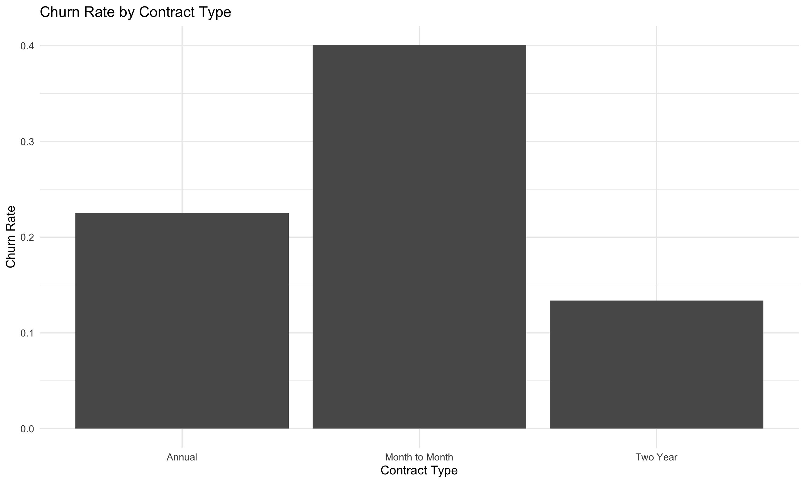
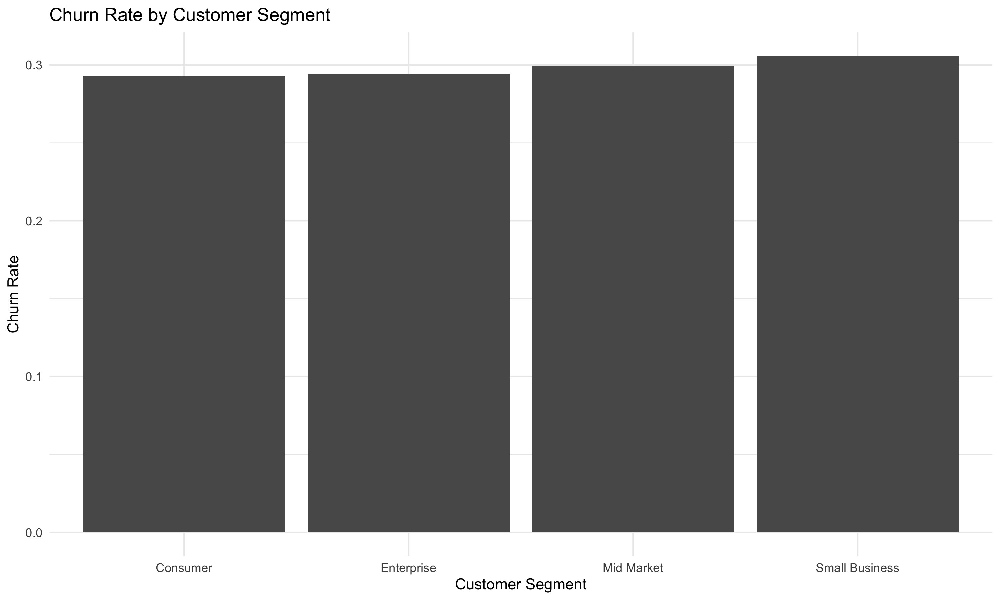
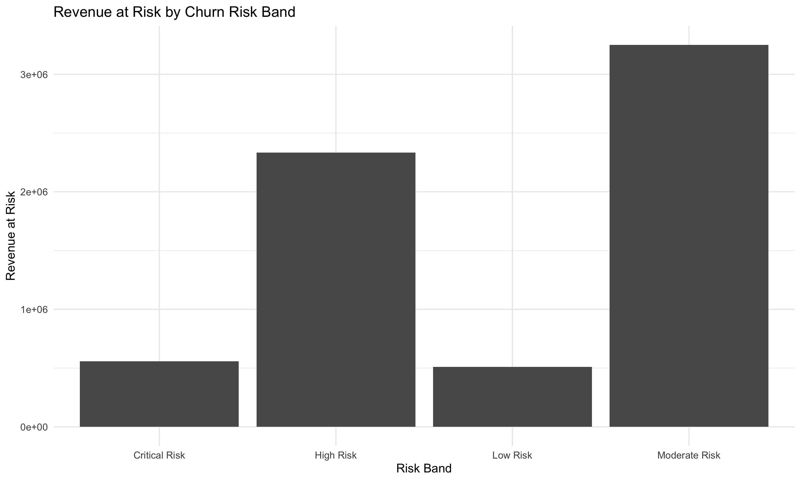

# Customer Churn Analysis in R

This project demonstrates how R can be used for customer churn analysis, statistical reporting, data visualization, logistic regression modeling, and dashboard ready output creation.

The project uses a simulated customer dataset with 10,000 customer records. It analyzes churn patterns by customer segment, contract type, and risk band while creating clean CSV outputs, visual summaries, and a logistic regression model.

---

## Tools Used

---

## Project Preview

### Churn Rate by Contract Type

### Churn Rate by Customer Segment

### Revenue at Risk by Risk Band

---

## Business Problem

Customer churn can reduce recurring revenue and make business growth harder to predict. Businesses need to know which customers are more likely to leave, which segments are at higher risk, and where revenue may be exposed.

This project answers:

> Which customers and customer groups are most likely to churn, and how much revenue is at risk?

---

## Dataset

The dataset contains 10,000 simulated customer records.

Fields include:

* Customer segment
* Contract type
* Region
* Tenure in months
* Monthly revenue
* Support tickets
* Late payments
* Product usage score
* Satisfaction score
* Last login days ago
* Discount percent
* Churn probability
* Churned status
* Annual revenue
* Customer lifetime value
* Risk flags
* Risk band

---

## Workflow

The R script performs the following steps:

1. Creates a simulated customer churn dataset
2. Builds churn probability using realistic business risk drivers
3. Creates customer lifetime value
4. Calculates revenue at risk
5. Creates usage, satisfaction, login, support, and payment risk flags
6. Assigns each customer to a churn risk band
7. Creates summary tables by customer segment, contract type, and risk band
8. Builds churn visuals with ggplot2
9. Trains a logistic regression model with caret
10. Evaluates model performance with a confusion matrix
11. Saves cleaned datasets, charts, and model outputs

---

## Files Created

| File | Description |
|---|---|
| `scripts/01_customer_churn_analysis.R` | Main R script |
| `data/raw/customer_churn_10000_rows.csv` | Raw simulated customer churn dataset |
| `data/cleaned/customer_churn_scored_dataset.csv` | Scored customer dataset with risk fields |
| `data/cleaned/segment_churn_summary.csv` | Churn summary by customer segment |
| `data/cleaned/contract_churn_summary.csv` | Churn summary by contract type |
| `data/cleaned/risk_band_summary.csv` | Churn and revenue at risk summary by risk band |
| `data/cleaned/model_performance_summary.csv` | Logistic regression model metrics |
| `images/churn_rate_by_contract_type.png` | Contract type churn chart |
| `images/churn_rate_by_customer_segment.png` | Customer segment churn chart |
| `images/revenue_at_risk_by_risk_band.png` | Revenue at risk chart |
| `outputs/model_confusion_matrix.txt` | Model confusion matrix output |

---

## Skills Demonstrated

* R programming
* RStudio workflow
* Data cleaning
* Data simulation
* dplyr data transformation
* ggplot2 visualization
* Customer churn analysis
* Risk scoring
* Revenue at risk analysis
* Logistic regression
* Model evaluation
* Dashboard ready output creation

---

## Business Value

This project shows how R can support customer success, finance, and executive reporting by identifying churn risk and revenue exposure.

A workflow like this can help a business:

* Identify high risk customers
* Compare churn risk across customer groups
* Estimate revenue at risk
* Prioritize retention efforts
* Create dashboard ready datasets
* Support decision making with model based insights

---

## Portfolio Note

This project is part of my R Portfolio and supports my broader work in data analytics, business intelligence, data science, SQL, Python, and Power BI.

[Back to R Portfolio](../README.md)
