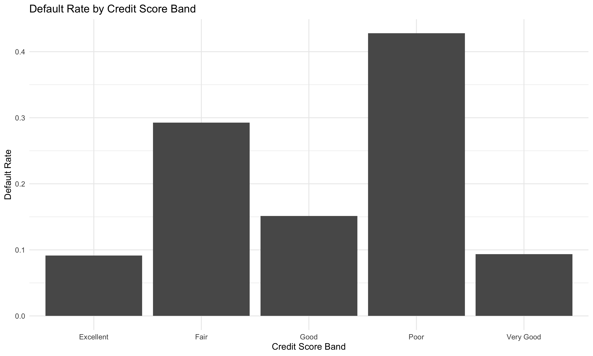
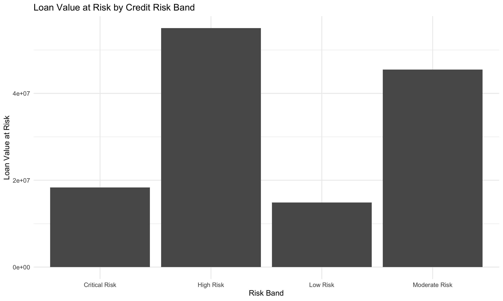
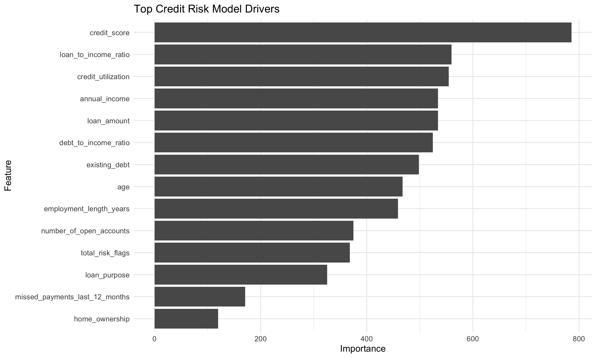
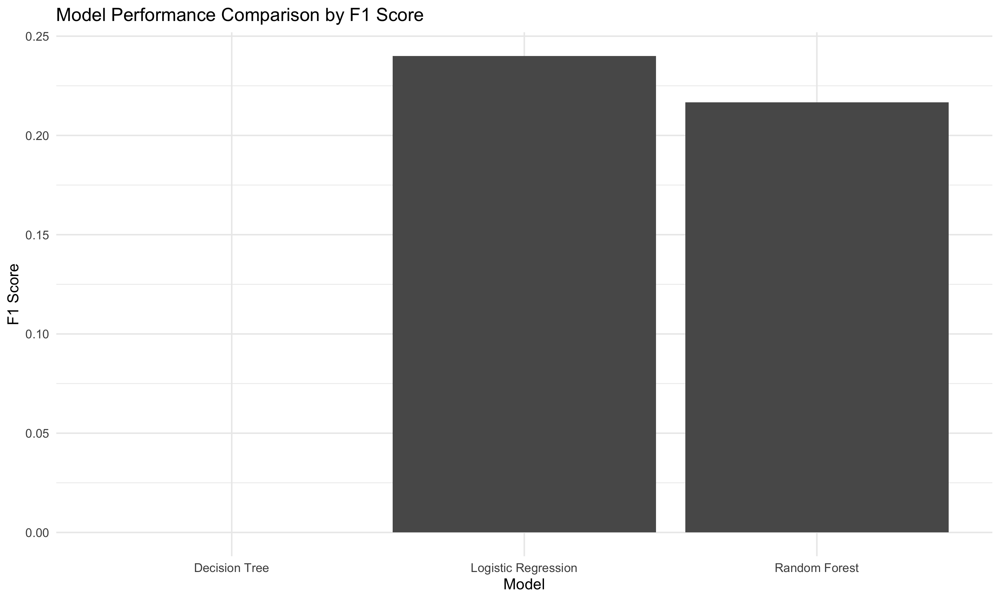
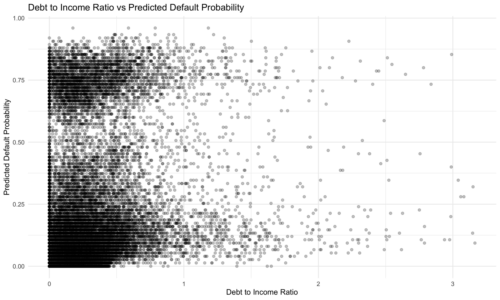
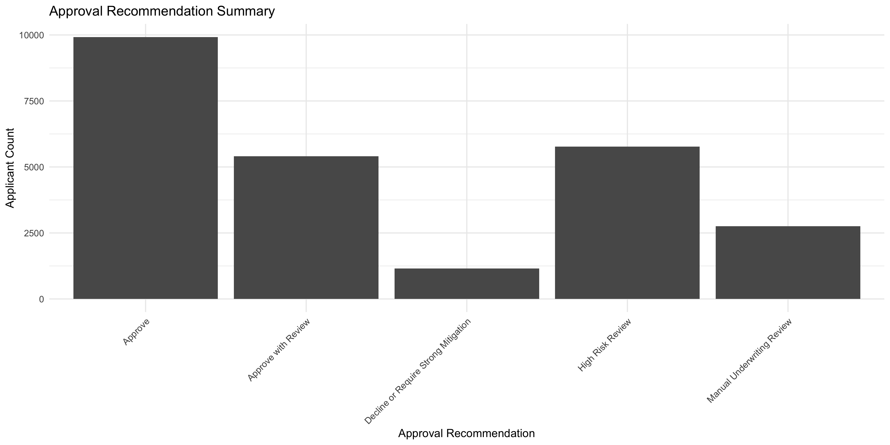

# Credit Risk Modeling and Loan Default Prediction in R

This project demonstrates how R can be used for credit risk modeling, loan default prediction, applicant risk scoring, model comparison, feature importance, and business decision support.

The project uses a simulated dataset with 25,000 loan applicant records. It analyzes default risk by credit score band, income band, risk band, and approval recommendation while creating clean CSV outputs, visual summaries, model performance results, and feature importance analysis.

---

## Tools Used

---

## Project Preview

### Default Rate by Credit Score Band

### Loan Value at Risk by Credit Risk Band

### Top Credit Risk Model Drivers

### Model Performance Comparison

### Debt to Income Ratio vs Predicted Default Probability

### Approval Recommendation Summary

---

## Business Problem

Credit risk decisions require balancing growth, approval volume, and default exposure. Financial institutions need to understand which applicants are more likely to default, what applicant characteristics are most predictive, and how loan value at risk changes across different risk groups.

This project answers:

> Which loan applicants are most likely to default, what factors drive default risk, and how can risk scores support approval recommendations?

---

## Dataset

The dataset contains 25,000 simulated loan applicant records.

Fields include:

* Applicant ID
* Age
* Annual income
* Credit score
* Loan amount
* Employment length
* Existing debt
* Number of open accounts
* Missed payments
* Credit utilization
* Loan purpose
* Home ownership
* Debt to income ratio
* Loan to income ratio
* Credit score band
* Income band
* Default probability
* Defaulted status
* Loan value at risk
* Risk flags
* Risk band
* Approval recommendation
* Predicted default probability

---

## Workflow

The R script performs the following steps:

1. Creates a simulated 25,000 row loan applicant dataset
2. Engineers credit risk features
3. Calculates debt to income and loan to income ratios
4. Creates credit score and income bands
5. Builds default probability using realistic financial risk drivers
6. Creates risk flags for debt, utilization, missed payments, credit score, and loan burden
7. Assigns each applicant to a risk band
8. Creates approval recommendation logic
9. Builds summary tables by credit score, income band, risk band, and approval recommendation
10. Trains Logistic Regression, Decision Tree, and Random Forest models
11. Compares model performance using accuracy, recall, specificity, precision, and F1 score
12. Scores applicants with predicted default probability
13. Creates feature importance outputs
14. Saves cleaned datasets, visuals, and model outputs

---

## Key Findings

The overall default rate in the simulated dataset was **21.27%**.

Applicants with poor credit scores had the highest default rate at **42.8%**, compared to **9.15%** for excellent credit score applicants.

Lower income applicants showed higher risk. Applicants earning under 40K had a default rate of **30.8%**, while applicants earning 120K plus had a default rate of **15.2%**.

The Critical Risk band had the highest default rate at **57.6%**, followed by High Risk at **38.1%**, Moderate Risk at **22.4%**, and Low Risk at **6.4%**.

The model comparison selected **Logistic Regression** as the best model. Logistic Regression achieved **78.7% accuracy**, **49.9% precision**, and an F1 score of **0.24**.

The top credit risk drivers included credit score, loan to income ratio, credit utilization, annual income, loan amount, debt to income ratio, existing debt, employment length, total risk flags, loan purpose, missed payments, and home ownership.

---

## Sample Results

### Credit Score Summary

| Credit Score Band | Total Applicants | Defaulted Applicants | Default Rate |
|---|---:|---:|---:|
| Poor | 2,204 | 943 | 42.8% |
| Fair | 8,834 | 2,586 | 29.3% |
| Good | 8,440 | 1,276 | 15.1% |
| Very Good | 4,047 | 378 | 9.34% |
| Excellent | 1,475 | 135 | 9.15% |

### Risk Band Summary

| Risk Band | Total Applicants | Defaulted Applicants | Default Rate |
|---|---:|---:|---:|
| Critical Risk | 1,152 | 663 | 57.6% |
| High Risk | 5,773 | 2,198 | 38.1% |
| Moderate Risk | 8,152 | 1,822 | 22.4% |
| Low Risk | 9,923 | 635 | 6.4% |

### Model Performance

| Model | Accuracy | Recall | Specificity | Precision | F1 Score |
|---|---:|---:|---:|---:|---:|
| Logistic Regression | 0.787 | 0.158 | 0.957 | 0.499 | 0.240 |
| Random Forest | 0.782 | 0.142 | 0.956 | 0.462 | 0.217 |
| Decision Tree | 0.787 | 0.000 | 1.000 | NA | NA |

---

## Files Created

| File | Description |
|---|---|
| `scripts/02_credit_risk_modeling.R` | Main R script |
| `data/raw/loan_applicants_25000_rows.csv` | Raw simulated loan applicant dataset |
| `data/cleaned/loan_applicants_scored.csv` | Scored applicant dataset with predicted default probability |
| `data/cleaned/credit_score_summary.csv` | Default summary by credit score band |
| `data/cleaned/income_band_summary.csv` | Default summary by income band |
| `data/cleaned/risk_band_summary.csv` | Default and loan value at risk summary by risk band |
| `data/cleaned/approval_recommendation_summary.csv` | Approval recommendation summary |
| `data/cleaned/model_performance_summary.csv` | Model performance comparison |
| `data/cleaned/feature_importance.csv` | Random Forest feature importance output |
| `images/` | Saved project visuals |
| `outputs/confusion_matrix.txt` | Best model confusion matrix output |

---

## Skills Demonstrated

* R programming
* RStudio workflow
* Credit risk modeling
* Loan default prediction
* Data simulation
* Feature engineering
* Risk scoring
* Logistic regression
* Decision tree modeling
* Random Forest modeling
* Model comparison
* Feature importance
* Classification metrics
* Revenue and loan value at risk analysis
* Approval recommendation logic
* Dashboard ready output creation

---

## Business Value

This project shows how R can support financial risk teams, lending teams, and executives by turning applicant data into risk scores, model outputs, and decision support tables.

A workflow like this can help a business:

* Identify higher risk loan applicants
* Compare default risk across credit and income groups
* Estimate loan value at risk
* Prioritize manual underwriting reviews
* Create approval recommendation logic
* Compare machine learning models
* Explain important credit risk drivers
* Prepare dashboard ready outputs for reporting

---

## Portfolio Note

This project is part of my R Portfolio and supports my broader work in data analytics, business intelligence, data science, SQL, Python, and Power BI.

[Back to R Portfolio](../README.md)
