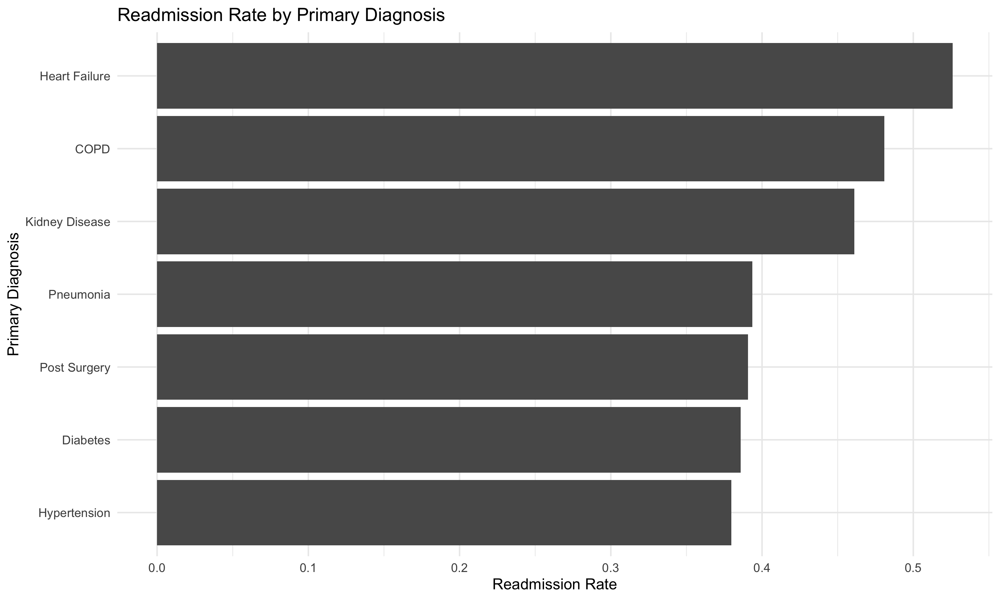
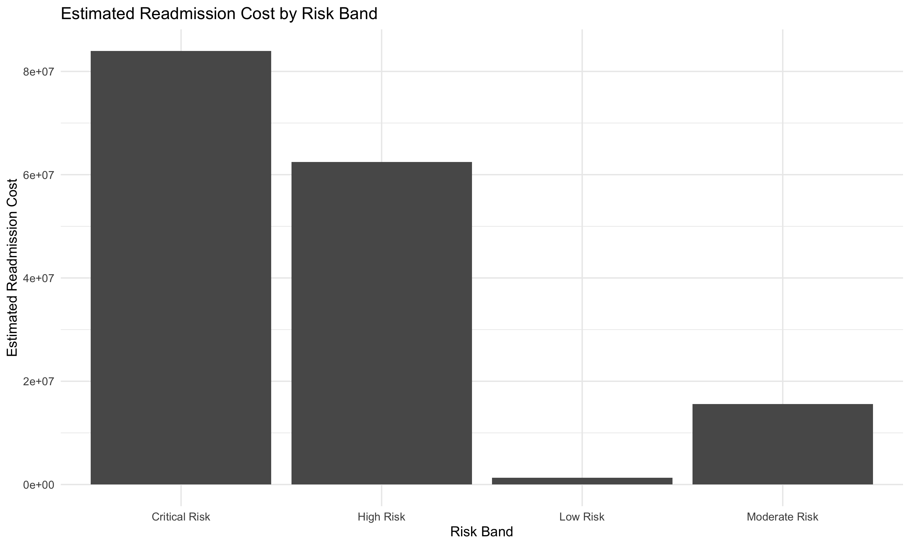
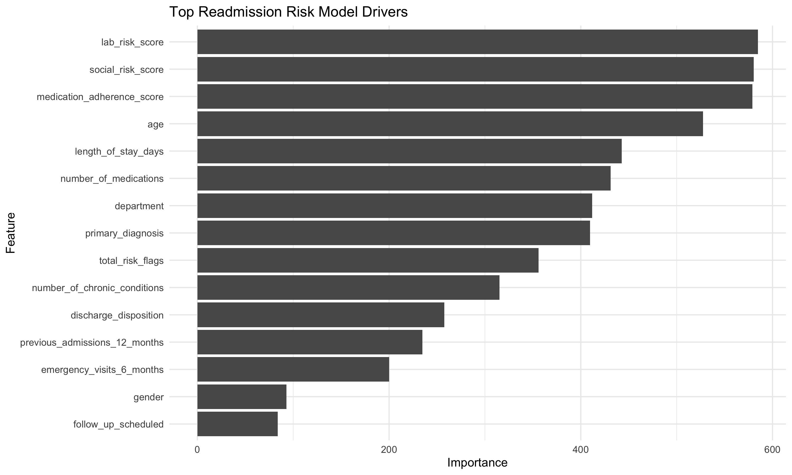
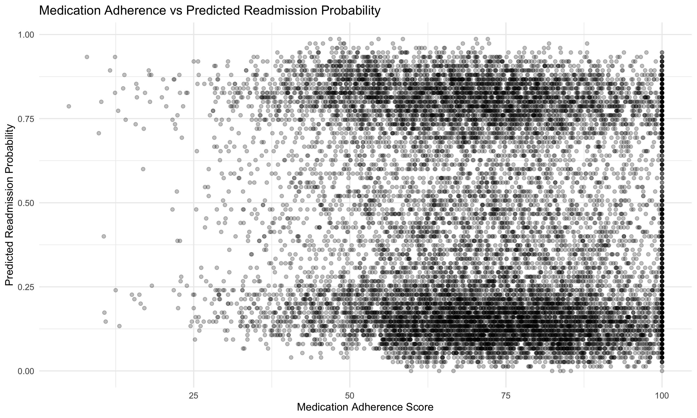
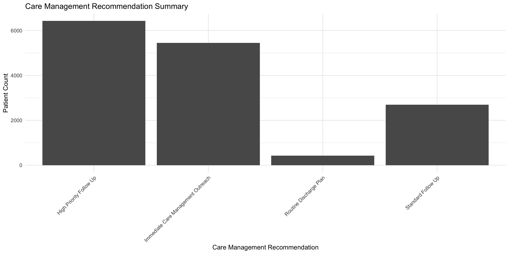

# Healthcare Readmission Risk Modeling in R

## Tools and Skills Used

This project demonstrates how R can be used for healthcare analytics, 30 day readmission risk modeling, patient risk scoring, care management prioritization, model comparison, feature importance, and dashboard ready reporting outputs.

The project uses a simulated dataset with 15,000 patient records. It analyzes readmission risk by diagnosis, department, age band, readmission risk band, and care management recommendation while creating clean CSV outputs, visual summaries, model performance results, and feature importance analysis.

> **Data Privacy Note:** This project uses fully simulated sample data created for portfolio demonstration purposes only. It does not contain real patient records, protected health information, personal health information, or data from real people.

---

## Project Preview

### Readmission Rate by Diagnosis

### Estimated Readmission Cost by Risk Band

### Top Readmission Risk Model Drivers

### Medication Adherence vs Predicted Readmission Probability

### Care Management Recommendation Summary

---

## Business Problem

Hospital readmissions are costly and can indicate gaps in discharge planning, follow up care, medication adherence, or chronic condition management. Healthcare teams need to identify which patients are most likely to be readmitted, what factors drive readmission risk, and which patients should receive care management outreach first.

This project answers:

> Which patients are most likely to be readmitted within 30 days, what factors drive readmission risk, and how can risk scoring support care management prioritization?

---

## Dataset

The dataset contains 15,000 simulated patient records.

Fields include patient demographics, primary diagnosis, hospital department, length of stay, previous admissions, emergency visits, medication count, chronic conditions, discharge disposition, follow up status, adherence score, social risk score, lab risk score, readmission probability, readmission status, estimated readmission cost, risk flags, risk bands, and care management recommendation.

---

## Workflow

1. Created a simulated 15,000 row patient readmission dataset
2. Engineered healthcare risk features
3. Created age bands and comorbidity bands
4. Built readmission probability using clinical and social risk drivers
5. Created risk flags for prior admissions, emergency visits, medication burden, chronic conditions, follow up status, adherence, social risk, and lab risk
6. Assigned each patient to a readmission risk band
7. Created care management recommendation logic
8. Built summary tables by diagnosis, department, risk band, care management group, and age band
9. Trained Logistic Regression, Decision Tree, and Random Forest models
10. Compared model performance using accuracy, recall, specificity, precision, and F1 score
11. Scored patients with predicted readmission probability
12. Created feature importance outputs
13. Saved cleaned datasets, visuals, and model outputs

---

## Key Findings

The overall 30 day readmission rate in the simulated dataset was **43.35%**.

Heart Failure had the highest readmission rate by diagnosis at **52.6%**, followed by COPD at **48.1%** and Kidney Disease at **46.1%**.

Pulmonology had the highest department readmission rate at **45.6%**, followed by Nephrology at **44.4%** and Emergency at **44.2%**.

The Critical Risk band had the highest readmission rate at **61.2%**, followed by High Risk at **39.0%**, Moderate Risk at **22.6%**, and Low Risk at **10.6%**.

Patients assigned to Immediate Care Management Outreach had a readmission rate of **61.2%**, showing the value of care management prioritization.

The model comparison selected **Logistic Regression** as the best model. Logistic Regression achieved **63.8% accuracy**, **60.4% precision**, and an F1 score of **0.533**.

The top readmission risk drivers included lab risk score, social risk score, medication adherence score, age, length of stay, number of medications, department, primary diagnosis, total risk flags, chronic conditions, discharge disposition, previous admissions, emergency visits, and follow up scheduled status.

---

## Sample Results

### Diagnosis Readmission Summary

| Primary Diagnosis | Total Patients | Readmitted Patients | Readmission Rate |
|---|---:|---:|---:|
| Heart Failure | 2,690 | 1,415 | 52.6% |
| COPD | 2,063 | 992 | 48.1% |
| Kidney Disease | 1,746 | 805 | 46.1% |
| Pneumonia | 1,926 | 758 | 39.4% |
| Post Surgery | 1,878 | 734 | 39.1% |
| Diabetes | 2,447 | 944 | 38.6% |
| Hypertension | 2,250 | 854 | 38.0% |

### Risk Band Summary

| Risk Band | Total Patients | Readmitted Patients | Readmission Rate |
|---|---:|---:|---:|
| Critical Risk | 5,448 | 3,337 | 61.2% |
| High Risk | 6,431 | 2,511 | 39.0% |
| Moderate Risk | 2,697 | 609 | 22.6% |
| Low Risk | 424 | 45 | 10.6% |

### Model Performance

| Model | Accuracy | Recall | Specificity | Precision | F1 Score |
|---|---:|---:|---:|---:|---:|
| Logistic Regression | 0.638 | 0.477 | 0.760 | 0.604 | 0.533 |
| Random Forest | 0.625 | 0.473 | 0.742 | 0.583 | 0.522 |
| Decision Tree | 0.567 | 0.000 | 1.000 | NA | NA |

---

## Files Created

| File | Description |
|---|---|
| `scripts/03_healthcare_readmission_risk_modeling.R` | Main R script |
| `data/raw/patient_readmission_15000_rows.csv` | Raw simulated patient readmission dataset |
| `data/cleaned/patient_readmission_scored.csv` | Scored patient dataset with predicted readmission probability |
| `data/cleaned/diagnosis_readmission_summary.csv` | Readmission summary by primary diagnosis |
| `data/cleaned/department_readmission_summary.csv` | Readmission summary by department |
| `data/cleaned/risk_band_summary.csv` | Readmission and estimated cost summary by risk band |
| `data/cleaned/care_management_summary.csv` | Care management recommendation summary |
| `data/cleaned/age_band_summary.csv` | Readmission summary by age band |
| `data/cleaned/model_performance_summary.csv` | Model performance comparison |
| `data/cleaned/feature_importance.csv` | Random Forest feature importance output |
| `images/` | Saved project visuals |
| `outputs/confusion_matrix.txt` | Best model confusion matrix output |

---

## Skills Demonstrated

* R programming
* Healthcare analytics
* Readmission risk modeling
* Patient risk scoring
* Data simulation
* Feature engineering
* Logistic regression
* Decision tree modeling
* Random Forest modeling
* Model comparison
* Feature importance
* Classification metrics
* Estimated readmission cost analysis
* Care management recommendation logic
* Dashboard ready output creation

---

## Business Value

This project shows how R can support healthcare analytics teams, care management teams, hospital operations, and executive leadership by turning patient level data into readmission risk scores and action oriented care management outputs.

A workflow like this can help a healthcare organization identify high risk patients, compare readmission risk by diagnosis and department, estimate readmission cost exposure, prioritize care management outreach, support discharge planning decisions, compare machine learning models, explain important readmission risk drivers, and prepare dashboard ready outputs for reporting.

---

## Portfolio Note

This project is part of my R Portfolio and supports my broader work in data analytics, business intelligence, data science, SQL, Python, and Power BI.

[Back to R Portfolio](../README.md)
